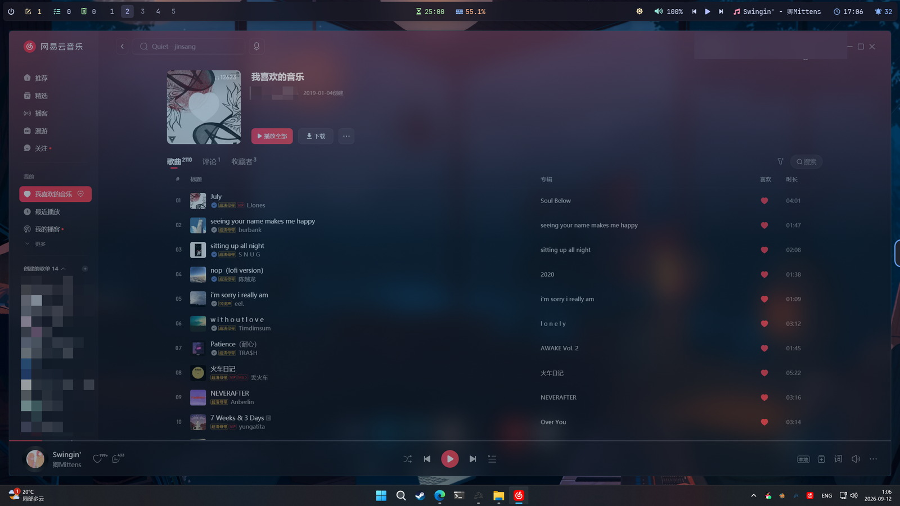
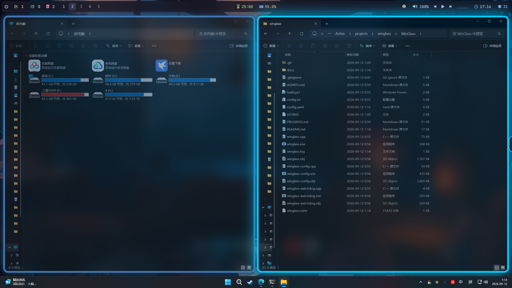
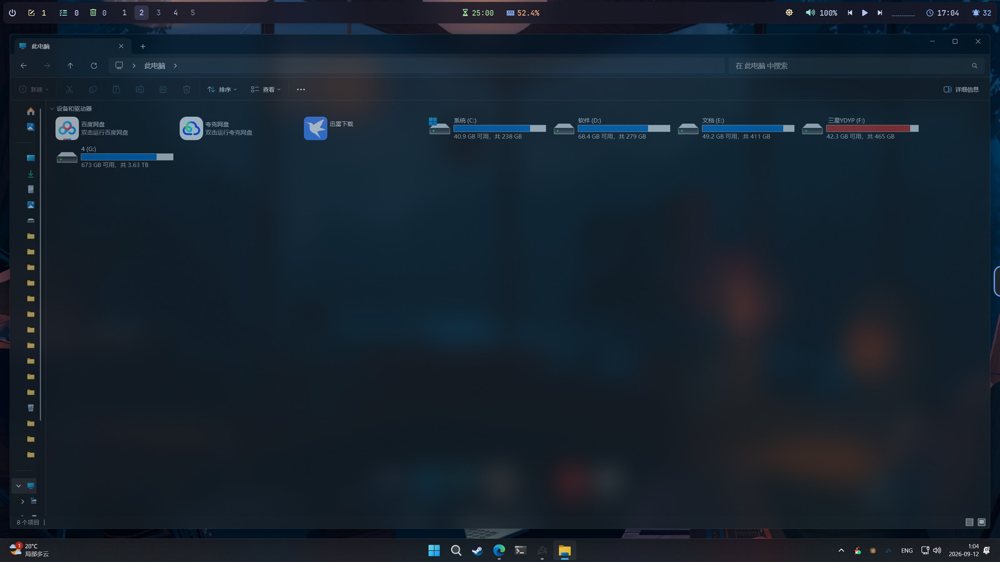
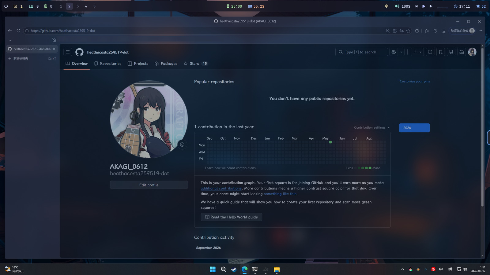
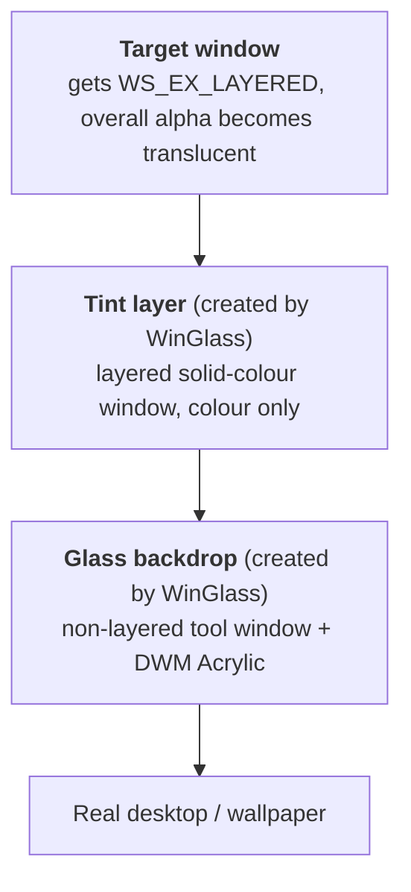
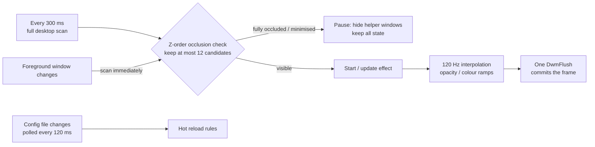
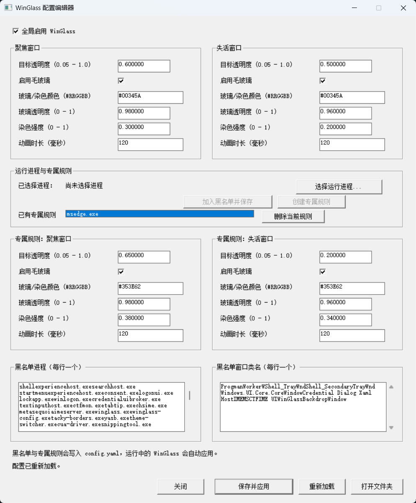

<div align="center">


# WinGlass

**Global frosted glass for Windows 11. No injection, no hooking, no patching.**

Browsers, terminals, file managers, chat apps — their content areas all turn into real acrylic glass; **the effect survives losing focus**, and **every window is restored the moment you quit**.

<sub><b>English</b> · <a href="README.zh-CN.md">简体中文</a></sub>


[](LICENSE)
[](https://github.com/heathacosta259519-dot)

</div>

---

## What it is

WinGlass is a windowless, always-on background utility. For every ordinary desktop window it slides an **acrylic glass backdrop** — rendered live by the Windows compositor — underneath the window, so the window's content floats semi-transparently over a frosted background:

- **Translucency** — the target window's content yields alpha so the glass behind it shows through
- **Blur** — DWM blurs the **real desktop** behind the window in real time: moving windows, playing video and animations all track live. It is not a screenshot, and not a periodically refreshed bitmap
- **Tinting** — a separate colour layer with per-window colour and density; it **only tints the background, never the text**
- **Survives losing focus** — once focus moves away, the window stays frosted and translucent instead of degrading into a flat grey slab
- **Separate focused / unfocused parameters with smooth transitions** — switching focus animates over milliseconds instead of snapping
- **Off whenever you want** — quit from the tray and every window goes back to normal; even a force-killed process leaves no orphaned translucent windows behind

## Preview



*NetEase Cloud Music — the window background is a cool frosted pane that follows the wallpaper, while list and lyric text stay crisp.*



*Even better together with the coloured borders of [Tacky Borders](https://github.com/luke-you/tacky-borders) — the glass provides depth, the border tells you which window has your keystrokes.*



*File Explorer — native system windows get the same blur and tint.*



*Microsoft Edge — the browser's toolbar and sidebar also let the wallpaper through.*

> Screenshots come from a Simplified-Chinese Windows install; the UI language has nothing to do with how WinGlass works.

## Features

| | Capability |
|---|---|
| 🌫️ | **Real-time blur** — composited by DWM straight from the desktop; window moves, video playback and animations all stay in sync |
| 🎨 | **Tint decoupled from blur** — you can tint with blur switched off; the tint lives on its own layer, so it physically cannot touch text pixels |
| 🪟 | **Covers every kind of window** — plain Win32, Electron (QQ / NetEase Cloud Music / ChatGPT / VS Code) and Explorer all work |
| ⚖️ | **Three-tier rules** — `blacklist > per-app > global`, with unspecified fields inherited automatically |
| 🔄 | **Hot reload** — save `config.yaml` and it takes effect in about 120 ms |
| 🎚️ | **Per-window control** — opacity, glass on/off, colour, density and animation duration, configurable per application |
| 🖱️ | **Config editor with a GUI** — no need to hand-write YAML; pick programs straight from the list of running processes |
| 🧊 | **No degradation when unfocused** — the effect does not sit on top of the system's material state machine, so it stays glassy after focus moves away |
| 🧹 | **Recoverable** — normal exit, crash or being killed from Task Manager all restore window styles |
| 🪶 | **Almost free** — idle CPU ≈ 1% of a single core, ~3 MB private memory (see the measurements below) |

## How it works

WinGlass never touches `dwm.exe`, never injects into any process, and does not use the system Mica/Acrylic material state machine. It does exactly three things: **make the target window step aside, slide two windows of its own underneath it, and pin the Z-order.**



WinGlass continuously verifies and locks the three layers into the order **target window > tint layer > glass backdrop**. The payoff:

1. **The blur is real** — the backdrop is an ordinary window, so DWM keeps compositing a blur of the real desktop behind it; video, animation and dragging are all live;
2. **The text stays clean** — colour is painted on its own layer *below* the window content, so it can never blend into text pixels;
3. **No degradation on focus loss** — the effect does not depend on the system's material state machine; changing focus only changes WinGlass's own opacity interpolation.

### Runtime behaviour



- **Pause instead of destroy** — a fully occluded or minimised window only hides its helper windows; Alt+Tab back and it is instantly there again, with nothing to rebuild;
- **Rule caching** — tracked windows are not re-resolved every scan; process names are only looked up for new windows or after a config change;
- **Synchronised submission** — all opacity/colour changes within one frame are batched and committed with a single `DwmFlush`, so multi-window transitions do not drift out of phase.

## Quick start

### Requirements

| Item | Requirement |
|---|---|
| OS | Windows 11 (developed and measured on Windows 11 26200) |
| Build | Visual Studio 2022 Build Tools (MSVC x64, C++17) |
| Runtime | No administrator rights, no .NET, no third-party runtime libraries |

### Build

From an x64 VS2022 Developer PowerShell:

```powershell
.\build.ps1
```

The build writes three executables into `release`:

| Artifact | Purpose |
|---|---|
| `winglass.exe` | Main program (resident, no window, tray icon) |
| `winglass-config.exe` | Visual configuration editor |
| `winglass-watchdog.exe` | Crash-recovery watchdog (launched automatically by the main program, **never run it yourself**) |

> Note: `build.ps1` points at the local toolchain (`vcvars64.bat`). On another machine change that one line, or just run the `cl` commands from a developer prompt.

### Run

```powershell
.\release\winglass.exe
```

On first run it reads `config.yaml` next to the executable (falling back to `config.ini`, then to built-in defaults). The build copies the example files in next to them — copy one first:

```powershell
Copy-Item config.example.yaml release\config.yaml   # use config.example.ini for the INI flavour
```

> The configuration is read from the executable's own directory, not the current one, so it has to sit in `release` next to `winglass.exe`.

There is no main window; the program only shows a notification-area icon.

Self-test (worth running once to confirm your system accepts the composition strategy):

```powershell
.\release\winglass.exe --self-test
```

```
config and system Acrylic API ok: ...\config.yaml global enabled=1 active_target=0.60 glass=0.98 apps=1 blacklist=123 classes=9 transition_ms=120
```

### Tray menu

Right-click the notification-area icon:

| Menu item | Description |
|---|---|
| Open config editor | Launches `winglass-config.exe` |
| Open config file | Opens the active `config.yaml` / `config.ini` in the default editor |
| Reload effect | Triggers a config hot reload manually |
| Enable / disable autostart | Writes the current user's `HKCU\...\CurrentVersion\Run`; no administrator needed |
| Exit | Restores every window style first, then quits |

## Configuration

`config.yaml` is the recommended, scriptable format (start by copying `config.example.yaml`, which is commented line by line). The repository does **not** contain the author's own `config.yaml` / `config.ini` (they are gitignored), so pulling the repo never fights with your configuration.

Rule priority is **`blacklist` > `applications` > `global`**, and fields omitted from a per-app rule are inherited from the global block.

```yaml
# Matching entries are skipped entirely (process name or window class name)
blacklist:
  - process: "SearchHost.exe"
  - class_name: "Shell_TrayWnd"

global:
  enabled: true
  focused:                      # window has focus
    target_opacity: 0.60        # how far the window content yields (lower = more transparent)
    enable_glass: true          # frosted backdrop on/off
    exclude_fullscreen: true    # restore the original window during full-screen video
    glass_color: "#00345A"      # glass tint
    glass_opacity: 0.98         # glass density ceiling
    tint_opacity: 0.30          # tint strength
    animation_duration_ms: 120  # focus-transition duration
  unfocused:                    # unfocused: a completely independent set
    target_opacity: 0.50
    enable_glass: true
    exclude_fullscreen: true
    glass_color: "#00345A"
    glass_opacity: 0.96
    tint_opacity: 0.20
    animation_duration_ms: 120

# Per-application overrides: write only the fields you want to change
applications:
  - match:
      process: "msedge.exe"
    rules:
      - type: focused
        config:
          target_opacity: 0.65
          glass_color: "#353E62"
          tint_opacity: 0.38
      - type: unfocused
        config:
          target_opacity: 0.20
          tint_opacity: 0.34
```

### Field reference

| YAML field | INI equivalent | Range | Default | Notes |
|---|---|---|---|---|
| `enabled` (global level) | `[Global] enabled` | `true` / `false` | `true` | Master switch; turning it off restores every window |
| `target_opacity` | `active_opacity` / `inactive_opacity` | `0–1` (also accepts `0–100`, `0–255`) | `0.90` / `0.82` | Opacity of the target window content |
| `enable_glass` | `active_acrylic` / `inactive_acrylic` | `true` / `false` | `true` | Frosted backdrop on/off; tint remains when off |
| `exclude_fullscreen` | `exclude_fullscreen` | `true` / `false` | `true` | Temporarily restore full-screen, borderless windows such as browser video and games |
| `glass_color` | `active_tint_color` / `inactive_tint_color` | `#RRGGBB` | `#2C3E58` / `#1F2A3C` | Glass colour |
| `glass_opacity` | `active_glass_opacity` / `inactive_glass_opacity` | `0–1` | `0.98` / `0.96` | Glass density ceiling |
| `tint_opacity` | `active_tint_strength` / `inactive_tint_strength` | `0–1` | `0.34` / `0.30` | Tint strength |
| `animation_duration_ms` | `transition_ms` | `0–5000` | `180` | Focus-transition duration; `0` = instant |
| `blacklist: - process` | `<processname>=true` under `[Blacklist]` | — | — | Skip by executable file name |
| `blacklist: - class_name` | YAML only | — | — | Skip by window class name |

A few conventions:

- YAML values may be quoted or not; `#` starts a comment only when preceded by whitespace.
- Focused and unfocused states are configured **separately**; in INI the `active_` / `inactive_` prefixes distinguish them.
- Legacy `blur_strength` / `blur_radius` keys are still parsed but have **no effect** — the blur radius belongs to DWM, see "Known limitations";
- Save `enabled: false` and the program restores all windows and stops working within a few hundred milliseconds.

### Config editor

`winglass-config.exe` provides a GUI covering the master switch, focused/unfocused opacity, glass on/off, colour, density, animation duration and the blacklist. Saving **atomically replaces** `config.yaml` (temp file first, then replace, so a failure mid-save cannot truncate your configuration), and the running main process hot-reloads automatically.

Focused and unfocused panels also include an “exclude full-screen video” checkbox; clear it when that state should continue applying the effect to a full-screen browser window.



The "running processes and per-app rules" section lists currently running processes:

- **Add to blacklist and save in one click** — matched permanently by `program.exe`, independent of the current PID;
- **Create a per-app rule** — starts from the current global appearance and configures focused and unfocused states for that program separately.

### Extract wallpaper colours from the clipboard (experimental)

The "extract palette from clipboard" button in the editor header reads an image from the clipboard and reports the ten most frequent colours. This also covers live-wallpaper software, because whatever it draws ends up in the screenshot:

1. Take a screenshot of the **bare desktop** (no icons) with any screenshot tool and copy it to the clipboard;
2. Open the editor and click the palette button;
3. The panel shows a preview, the image size and sampling statistics, followed by ten swatches with their hex value and share of the image;
4. Select a swatch, then pick a target:
   - **Apply to global** — writes the global focused and unfocused tint colour;
   - **Apply to every rule (including per-app)** — overwrites the global colour and every per-app rule, after a confirmation prompt;
5. Colours are only written into the editor fields; nothing reaches `config.yaml` until you press "save and apply", and "reload" discards the change.

Both `CF_DIBV5` / `CF_DIB` (what nearly every screenshot tool publishes) and a clipboard that only offers the registered `PNG` format are supported, at 8/16/24/32 bpp. To check what a given screenshot produces, run `winglass-config.exe --palette-self-test`.

## Command-line arguments

| Argument | Purpose |
|---|---|
| *(none)* | Run as a resident process |
| `--self-test` | Parse the configuration and verify the system accepts the glass composition strategy (exit codes: `0` success / `2` config read failure / `3` composition unavailable) |
| `--palette-self-test` | Config editor only: decode the clipboard image and print the extracted palette, to diagnose screenshot/colour problems |
| `--interactive-relaunch` | Internal: second launch marker after handing over from an isolated desktop to the user desktop |
| `--set-startup=enable\|disable` | Internal: helper mode that only writes the registry autostart entry when elevation is required in a restricted environment |

## Runtime files

| File | Purpose |
|---|---|
| `config.yaml` / `config.ini` | Configuration (YAML preferred, INI used when no YAML exists) |
| `winglass.state` | Recovery log: HWND, PID, original extended styles and layered attributes of every modified window, plus a window identity marker |
| `winglass.log` | Low-frequency diagnostic log: desktop handover, tray registration failures, idle-scan anomalies |
| `winglass.startup-state` | Cached autostart toggle state, so the tray menu shows the right label across identity boundaries |

All of these files (along with `*.exe` and `*.obj`) are excluded by `.gitignore`.

## Security

- **No injection, no hooking, no patching** — only public Win32 APIs and `SetWindowCompositionAttribute` exported from `user32.dll`; no system file is modified and no process is injected into.
- **Never touches other apps' drawing** — the only change to a target window is adding the `WS_EX_LAYERED` extended style; everything else is WinGlass's own helper windows.
- **Lossless restore** — if a target window is already a layered window, WinGlass reads its existing alpha / colour key / flags before deciding whether to process it; **if it cannot read them, it skips the window** rather than doing a lossy restore.
- **Recovers even from a crash** — the main process writes recovery information to `winglass.state` and starts a separate watchdog process whose only job is to wait and restore. Whether the main process exits normally, crashes or is killed, window styles are put back and no translucent orphan is left behind.
- **Guarded against restoring the wrong window** — before restoring, the window handle, owning process and a window property marker are all verified, so a recycled handle can never make it modify the wrong window.
- **Single instance** — only one main process can run at a time.

## Performance

| Metric | Measured |
|---|---|
| Idle CPU (2 windows managed) | `0.90 s` over a 90 s sample ≈ **1% of one core** |
| Main process memory | **3.3 MB private / 26 MB working set**, 2 threads, 303 handles |
| Watchdog memory | **7.9 MB** |
| Long-run stability | 40 minutes continuous: private memory 3.3 → 3.3 MB, handles 303 → 303 — **no growth** |
| Desktop scan interval | 300 ms (immediately on foreground change) |
| State tracking rate | 8 ms (120 Hz interpolation) |
| Windows processed at once | 12 (front-most by Z-order; the foreground window is never dropped) |
| Config hot-reload latency | ≈ 120 ms |

Design choices that keep the cost down: fully occluded or minimised windows are paused rather than rebuilt; tracked windows are not re-resolved every scan; full Z-order verification of helper windows is throttled; timing uses `GetTickCount64` so it never wraps on long runs.

## Known limitations

1. **The blur radius cannot be changed.** The frost is rendered by DWM and its radius is hard-coded inside the system; there is no public API or registry key for it. `blur_strength` in the config is therefore ignored (kept only for backward compatibility). Fine-grained control would require a self-drawn blur, at the cost of real-time behaviour.
2. **WPF windows may not work.** They typically paint a fully opaque surface and never yield their background; add the process to `blacklist` for those.
3. **Full-screen exclusion is window-level**: it reliably handles a browser/player full-screen surface, but cannot identify the rectangle of an embedded HTML video inside an ordinary browser window.
4. **Tooltips are skipped by default**: native `tooltips_class32` / `msctls_tooltip32` and browser classes containing `tooltip` are ignored by class name, without size/title heuristics.
5. **System windows are skipped by default**: desktop, taskbar, secondary taskbars and UWP core windows are skipped directly by the program, as are all tool windows (`WS_EX_TOOLWINDOW`) and owned popups; the bundled example config additionally blacklists Start menu, Search and notification-area hosts. This avoids most cases where "beautifying" makes things look worse.
6. **UWP / Store apps**: their content is self-drawn, so whether the background shows through depends on the app.
7. Only a **Windows 11 + x64** build script is provided; other platforms need their own compiler flags.

## Project structure

```
.
├─ winglass.cpp            # main program: window scanning, rule parsing, Z-order, rendering, tray, restore
├─ winglass-watchdog.cpp   # separate watchdog process: restores window styles after a crash
├─ winglass-config.cpp     # visual configuration editor (Win32 + common controls)
├─ winglass.rc             # icon resource script (compiled into all three exes)
├─ winglass-resource.h     # shared resource identifiers
├─ build.ps1               # one-shot build (MSVC x64)
├─ config.example.yaml     # example config (recommended flavour, copy to config.yaml)
├─ config.example.ini      # example config (INI flavour)
├─ assets/                 # icon design sources (.svg / .png / .ico)
├─ docs/                   # screenshots used by the READMEs
├─ README.md               # English (this file)
└─ README.zh-CN.md         # 简体中文
```

## FAQ

**Q: Will it crash Explorer like some other beautification tools?**
A: No. WinGlass does not inject into Explorer and does not modify its code — it only adds an extended style and creates its own helper windows; the tray icon is rebuilt automatically if Explorer restarts.

**Q: Why do some windows appear to have no effect?**
A: Three possibilities: (1) it is a system window or tool window and is skipped by default; (2) it paints its own opaque background (typically WPF apps), so there is no background to yield; (3) it is listed in `blacklist`. The first two can be handled as needed with `blacklist` or per-app rules.

**Q: Can windows be fully restored after I turn it off?**
A: Yes. Normal exit, tray "Exit", a crash or a force-kill all restore the windows; on exit it also forces one repaint to avoid visual ghosts.

**Q: How is this different from MicaForEveryone or DWMBlurGlass?**
A: They take different routes — system-material tools are limited by "the window must support a material", while tools that hook into DWM depend on modifying system components. WinGlass depends neither on the window supporting a material nor on modifying system files; the trade-off is that the blur radius can only be the single level the system provides.

**Q: Why does enabling autostart occasionally trigger a UAC prompt?**
A: Normally it only writes the current user's `Run` key and needs no administrator. Only in restricted/isolated environments, where the real user registry view is unreadable, does it request elevation once, performed by a helper process that does nothing but write the registry entry.

## Credits

- Inspired by the Windows 11 global frosted-glass effect demonstrated by Bilibili creator **awfu_l_bed** (that work is not open source and served only as a quality benchmark); WinGlass is a completely independent implementation created after confirming the approach was viable.
- Thanks to everyone who has publicly discussed `SetWindowCompositionAttribute`, DWM composition and layered-window behaviour.

## License

Licensed under the **MIT** license — Copyright (c) 2026 **Akagi_0612**, see [`LICENSE`](LICENSE).

You are free to use, modify, redistribute and use it commercially; just keep the copyright notice. If WinGlass makes your desktop a little nicer, a ⭐ back here is all I ask.
