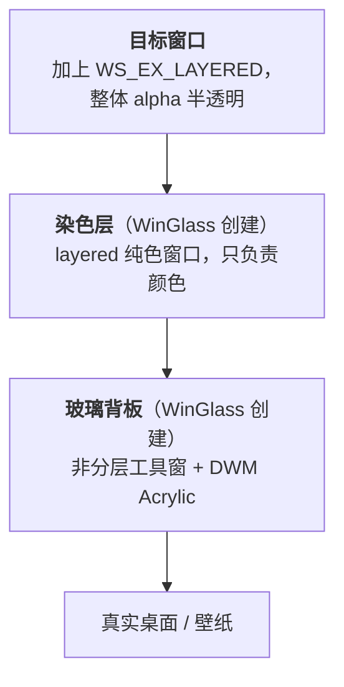
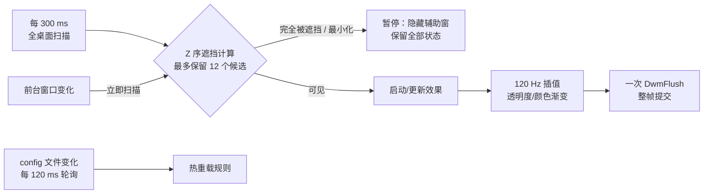

<div align="center">


# WinGlass

**Windows 11 全局磨砂玻璃。不注入、不 Hook、不 Patch。**

浏览器、终端、文件夹、聊天软件——内容区统统变成真正的亚克力玻璃；**失焦不掉效果**，**退出即刻还原**。

<sub><a href="README.md">English</a> · <b>简体中文</b></sub>


[](LICENSE)
[](https://github.com/heathacosta259519-dot)

</div>

---

## 这是什么

WinGlass 是一个无界面的常驻小工具。它把每一个普通桌面窗口「垫」上一层由 Windows 合成器实时渲染的**亚克力玻璃背板**，让窗口内容整体半透明地浮在磨砂背景之上：

- **半透明**：目标窗口内容整体让位，后面的玻璃透出来
- **磨砂**：DWM 实时模糊窗口背后的**真实桌面**——视频、动画、拖窗口全部实时跟随，不是截图，也不是定时刷新的位图
- **染色**：独立的一层颜色玻璃，色值、浓度逐窗口可配；**只染背景，不染文字**
- **失焦保持**：切走焦点后，失焦窗口依然是磨砂半透明，不会降级成一块死灰实色
- **聚焦 / 失焦两套参数 + 平滑过渡**：切换焦点时按毫秒级动画渐变，不硬跳
- **随时可关**：托盘一键退出，窗口恢复原状；进程被强杀也不会留下半透明孤儿窗口

## 效果预览


*网易云音乐：窗口背景是一层随桌面壁纸流动的冷色磨砂玻璃，列表与歌词文字依旧清晰锐利。*


*搭配 [Tacky Borders](https://github.com/luke-you/tacky-borders) 的彩色描边，效果更佳——磨砂玻璃负责通透，描边负责告诉你在敲哪个窗口。*


*文件资源管理器——系统原生窗口同样拿到磨砂与染色。*


*Microsoft Edge——浏览器窗口的工具栏与侧栏同样透出背后的壁纸。*

## 特性一览

| | 能力 |
|---|---|
| 🌫️ | **实时真模糊**：由 DWM 直接采样桌面合成，窗口移动 / 视频播放 / 动画全程跟手 |
| 🎨 | **染色与模糊解耦**：关掉模糊也能单独染色；染色走独立图层，物理上碰不到文字像素 |
| 🪟 | **全窗口覆盖**：普通 Win32、Electron（QQ / 网易云 / ChatGPT / VS Code）、Explorer 都能做 |
| ⚖️ | **三段式规则**：`黑名单 > 应用专属 > 全局`，缺省字段自动继承 |
| 🔄 | **热重载**：改 `config.yaml` 存盘即生效，约 120 ms |
| 🎚️ | **逐窗口精细控制**：透明度、玻璃开关、颜色、浓度、动画时长，可对每个程序单独设置 |
| 🖱️ | **带 GUI 的配置编辑器**：不用手写 YAML，能直接从「正在运行的进程」里挑程序加规则 |
| 🧊 | **失焦不退化**：这套效果不挂在系统的材质状态机上，所以焦点切走也保持玻璃 |
| 🧹 | **可恢复**：正常退出、崩溃、被任务管理器强杀，三种情况都能把窗口样式还回去 |
| 🪶 | **几乎不占资源**：空闲时 CPU ≈ 0%，内存约 13 MB（见下方实测） |

## 它是怎么做到的

WinGlass 不碰 `dwm.exe`、不注入任何进程、不使用系统 Mica/Acrylic 材质状态机。它只做三件事：**让目标窗口让位、在它下面垫两层自己的窗口、把 Z 序钉死。**



三层 Z 序由 WinGlass 持续校验并锁定为 **目标窗口 > 染色层 > 玻璃背板**。这样做的收益是：

1. **模糊是真的**：背板是普通窗口，DWM 会持续对它背后的真实桌面做模糊合成，视频、动画、拖动全部实时；
2. **文字是干净的**：颜色画在独立的一层里、位于窗口内容之下，永远不会和文字像素混色；
3. **失焦不退化**：效果不依赖系统的材质状态机，焦点切换只改变 WinGlass 自己的透明度插值。

### 运行机制



- **暂停而非销毁**：被完全遮挡或最小化的窗口只是隐藏辅助窗，Alt+Tab 切回来时瞬间恢复，不需要重建；
- **规则缓存**：已跟踪的窗口不会反复查询进程名，只有新窗口或配置变更后才重新解析规则；
- **同步提交**：同一帧里的所有透明度/颜色变化合并成一批再 `DwmFlush`，避免多窗口过渡出现相位差。

## 快速开始

### 环境要求

| 项目 | 要求 |
|---|---|
| 系统 | Windows 11（已在 Windows 11 26200 上实测） |
| 编译 | Visual Studio 2022 生成工具（MSVC x64，C++17） |
| 运行 | 无需管理员权限，无需 .NET，无第三方运行库 |

### 构建

在 x64 的 VS2022 开发者 PowerShell 里：

```powershell
.\build.ps1
```

产出三个可执行文件：

| 产物 | 作用 |
|---|---|
| `winglass.exe` | 主程序（常驻，无窗口，有托盘图标） |
| `winglass-config.exe` | 可视化配置编辑器 |
| `winglass-watchdog.exe` | 崩溃恢复监护进程（由主程序自动拉起，**不需要手动运行**） |

> 提示：`build.ps1` 里的工具链路径指向本机安装位置（`vcvars64.bat`）。换机器时改这一行，或直接在开发者命令行里手跑 `cl` 命令即可。

### 运行

```powershell
.\winglass.exe
```

首次运行会在 exe 同目录读取 `config.yaml`（不存在则回退 `config.ini`，两者都没有就用内置默认值）。仓库里带的是示例文件，先复制一份再按需改：

```powershell
Copy-Item config.example.yaml config.yaml   # 想用 INI 写法就复制 config.example.ini
```

程序没有主窗口，只在通知区域显示一个图标。

自检（推荐先跑一次，确认系统接受合成策略）：

```powershell
.\winglass.exe --self-test
```

```
config and system Acrylic API ok: ...\config.yaml global enabled=1 active_target=0.60 glass=0.98 apps=1 blacklist=123 classes=9 transition_ms=120
```

### 托盘菜单

右键通知区域图标：

| 菜单项 | 说明 |
|---|---|
| 打开配置编辑器 | 启动 `winglass-config.exe` |
| 打开配置文件 | 用系统默认程序打开当前生效的 `config.yaml` / `config.ini` |
| 重新加载效果 | 手动触发一次配置热重载 |
| 启用 / 关闭开机启动 | 写当前用户的 `HKCU\...\CurrentVersion\Run`，不需要管理员 |
| 退出 | 先还原全部窗口样式再退出 |

## 配置

推荐用脚本化的 `config.yaml`（从仓库里的 `config.example.yaml` 复制起步，示例里带逐行注释）。仓库**不含**作者本机在用的 `config.yaml` / `config.ini`（已 gitignore），所以拉下来不会跟你自己的配置打架。

规则的优先级是 **`blacklist` > `applications` > `global`**，应用专属规则缺省的字段自动继承全局。

```yaml
# 命中即完全跳过，不做任何处理（支持进程名与窗口类名两种匹配）
blacklist:
  - process: "SearchHost.exe"
  - class_name: "Shell_TrayWnd"

global:
  enabled: true
  focused:                      # 窗口处于聚焦态
    target_opacity: 0.60        # 目标窗口内容让位程度（越低越透）
    enable_glass: true          # 是否启用磨砂
    exclude_fullscreen: true    # 全屏视频/游戏时恢复原窗口
    glass_color: "#00345A"      # 玻璃染色
    glass_opacity: 0.98         # 玻璃浓度上限
    tint_opacity: 0.30          # 染色强度
    animation_duration_ms: 120  # 焦点切换动画时长
  unfocused:                    # 失焦态：两套参数各管一套
    target_opacity: 0.50
    enable_glass: true
    exclude_fullscreen: true
    glass_color: "#00345A"
    glass_opacity: 0.96
    tint_opacity: 0.20
    animation_duration_ms: 120

# 针对单个程序的覆盖，只需写出要改的字段
applications:
  - match:
      process: "msedge.exe"
    rules:
      - type: focused
        config:
          target_opacity: 0.65
          glass_color: "#353E62"
          tint_opacity: 0.38
      - type: unfocused
        config:
          target_opacity: 0.20
          tint_opacity: 0.34
```

### 字段参考

| YAML 字段 | INI 等价写法 | 取值范围 | 默认值 | 说明 |
|---|---|---|---|---|
| `enabled`（global 级） | `[Global] enabled` | `true` / `false` | `true` | 总开关；关掉会还原所有窗口 |
| `target_opacity` | `active_opacity` / `inactive_opacity` | `0–1`（也接受 `0–100`、`0–255`） | `0.90` / `0.82` | 目标窗口内容的不透明度 |
| `enable_glass` | `active_acrylic` / `inactive_acrylic` | `true` / `false` | `true` | 是否启用磨砂背板；关掉后仍保留纯染色 |
| `exclude_fullscreen` | `exclude_fullscreen` | `true` / `false` | `true` | 检测到覆盖整个显示器的无边框窗口时，暂时恢复原样；适合浏览器全屏视频和游戏 |
| `glass_color` | `active_tint_color` / `inactive_tint_color` | `#RRGGBB` | `#2C3E58` / `#1F2A3C` | 玻璃颜色 |
| `glass_opacity` | `active_glass_opacity` / `inactive_glass_opacity` | `0–1` | `0.98` / `0.96` | 玻璃浓度上限 |
| `tint_opacity` | `active_tint_strength` / `inactive_tint_strength` | `0–1` | `0.34` / `0.30` | 染色强度 |
| `animation_duration_ms` | `transition_ms` | `0–5000` | `180` | 焦点切换动画时长，`0` = 立即切换 |
| `blacklist: - process` | `[Blacklist]` 下 `进程名=true` | — | — | 按可执行文件名跳过 |
| `blacklist: - class_name` | 仅 YAML 支持 | — | — | 按窗口类名跳过 |

几点约定：

- YAML 里的值加不加引号都可以；`#` 仅在前面有空白时才当注释。
- 焦点态与失焦态**分别配置**，INI 写法用 `active_` / `inactive_` 前缀区分。
- 旧配置里的 `blur_strength` / `blur_radius` 仍会被解析但**不会生效**——模糊半径由 DWM 决定，见「已知限制」。
- 把 `enabled` 改成 `false` 存盘，程序会在几百毫秒内还原所有窗口并停止处理。

### 配置编辑器

`winglass-config.exe` 提供图形界面，覆盖全局开关、聚焦/失焦透明度、玻璃开关、颜色、浓度、动画时长与黑名单，保存时**原子替换** `config.yaml`（先写临时文件再替换，中途失败不会截断原配置），运行中的主程序会自动热加载。

聚焦/失焦设置中还提供“全屏视频时排除”复选框；取消勾选后，该状态下的浏览器全屏窗口仍会继续应用效果。


编辑器里的「运行进程与专属规则」区会列出当前正在运行的进程：

- **一键加入黑名单并保存**：永久按 `程序.exe` 匹配，不依赖当次 PID；
- **创建专属规则**：以当前全局外观为起点，分别为该程序配置聚焦态与失焦态。

### 从剪贴板提取壁纸配色（实验性）

主界面右上角的「从剪贴板提取配色（实验）」按钮会读取剪贴板里的图片，分析出出现频率最高的 10 个颜色。这样连动态壁纸、壁纸引擎绘制的内容也能覆盖，因为它们同样会被截进图里：

1. 用任意截图工具截取**无图标桌面**并复制到剪贴板；
2. 打开编辑器，点「从剪贴板提取配色（实验）」；
3. 面板顶部显示图片预览、尺寸与采样统计，下方是 10 个色块（含十六进制值与占比）；
4. 点选一个色块，再选择应用目标：
   - **应用到全局**：写入全局的聚焦色与失焦色；
   - **应用到全部规则（含专属）**：覆盖全局与每条专属规则的聚焦色和失焦色，执行前会弹出确认框；
5. 颜色只写入编辑器控件，仍需点「保存并应用」才会落盘到 `config.yaml`，点「重新加载」可以整体放弃。

读取支持 `CF_DIBV5` / `CF_DIB`（绝大多数截图工具）以及只提供注册格式 `PNG` 的剪贴板，位深 8/16/24/32 bpp 均可解析。若结果不符合预期，可用 `winglass-config.exe --palette-self-test` 在命令行打印当前剪贴板图片的解析结果。

## 命令行参数

| 参数 | 用途 |
|---|---|
| *（无）* | 常驻运行 |
| `--self-test` | 解析配置并验证当前系统接受玻璃合成策略（退出码：`0` 成功 / `2` 配置读取失败 / `3` 合成不可用） |
| `--palette-self-test` | 仅配置编辑器：解析剪贴板图片并打印提取出的配色，用于排查截图/取色异常 |
| `--interactive-relaunch` | 内部使用：从隔离桌面转交到用户桌面后的二次启动标记 |
| `--set-startup=enable\|disable` | 内部使用：受限环境下需要提权时，只负责写注册表启动项的辅助模式 |

## 运行期文件

| 文件 | 作用 |
|---|---|
| `config.yaml` / `config.ini` | 配置（优先 YAML，YAML 不存在时用 INI） |
| `winglass.state` | 恢复日志：记录被修改窗口的 HWND、PID、原始扩展样式与分层参数，以及窗口身份标记 |
| `winglass.log` | 低频诊断日志：桌面转交、托盘注册失败、扫描空转等异常事件 |
| `winglass.startup-state` | 「开机启动」开关的状态缓存，供跨身份边界时托盘菜单显示正确文案 |

以上运行期文件（连同 `*.exe`、`*.obj`）已在 `.gitignore` 中排除。

## 安全性

- **不注入、不 Hook、不 Patch**：全程只调用公开 Win32 API 与 `user32.dll` 导出的 `SetWindowCompositionAttribute`，不改动任何系统文件，不注入任何进程。
- **不改别人的绘制**：只给目标窗口加上 `WS_EX_LAYERED` 扩展样式，并创建属于 WinGlass 自己的辅助窗口。
- **无损还原**：若目标窗口本身就是分层窗口，程序会先读取它原本的 alpha / color key / flags 再决定是否处理；**读不出来就跳过它**，不做有损恢复。
- **崩溃也能还原**：主程序把恢复信息写进 `winglass.state`，同时拉起一个**只负责等待与还原**的独立监护进程。主进程无论是正常退出、崩溃还是被强杀，窗口样式都会被还回去，不会留下半透明的孤儿窗口。
- **防误改**：恢复前会同时校验窗口句柄、所属进程与窗口属性标记，避免句柄被系统复用后改错窗口。
- **单实例**：同一时刻只会有一个主进程在跑。

## 性能

| 指标 | 实测值 |
|---|---|
| 空闲 CPU（接管 2 个窗口） | 90 秒采样 `0.90 s` ≈ **单核 1%** |
| 主进程内存 | **私有 3.3 MB / 工作集 26 MB**，2 个线程、303 句柄 |
| 监护进程内存 | **7.9 MB** |
| 长时稳定性 | 连续运行 40 分钟：私有内存 3.3 → 3.3 MB、句柄 303 → 303，**无增长** |
| 桌面扫描周期 | 300 ms（前台变化时立即触发） |
| 状态跟踪频率 | 8 ms（120 Hz 插值） |
| 同时处理的窗口上限 | 12 个（Z 序最靠前的，前台永不被裁掉） |
| 配置热重载延迟 | ≈ 120 ms |

降低开销的设计：完全被遮挡或最小化的窗口直接暂停而不是重建；已跟踪窗口不再反复解析进程规则；辅助窗的完整 Z 序校验做了节流；耗时的时间基准使用 `GetTickCount64`，长时间运行不会回绕。

## 已知限制

1. **模糊半径不可调**。磨砂由 DWM 渲染，半径写死在系统内部，没有公开 API 或注册表项可以改。因此配置里的 `blur_strength` 会被忽略（保留仅为兼容旧配置）。想要"精细调节模糊强度"，只能改用自绘模糊方案，代价是失去实时性。
2. **WPF 窗口可能无效**。它们常用完全不透明的自绘表面，让不出背景；把对应进程加进 `blacklist` 即可。
3. **全屏排除是窗口级判断**：它能可靠处理浏览器/播放器的全屏窗口，但无法从浏览器外部识别普通网页内嵌视频的矩形区域；后者仍会沿用整个浏览器窗口的效果。
4. **悬浮提示默认跳过**：程序会按窗口类名忽略原生 `tooltips_class32` / `msctls_tooltip32` 以及包含 `tooltip` 的浏览器提示窗口，不依赖大小或标题猜测。
4. **系统窗口默认跳过**：桌面、任务栏、副屏任务栏、UWP 核心窗口由程序直接跳过，所有工具窗口（`WS_EX_TOOLWINDOW`）与有属主的弹窗也不处理；随附的示例配置另外把开始菜单、搜索、通知区域宿主列入了黑名单。这样能避开大多数"美化之后反而难看"的场景。
5. **UWP / 商店应用** 的内容区由应用自绘，能否透出背景取决于该应用本身。
6. **仅提供 Windows 11 + x64 的构建脚本**，其他平台需要自行调整编译参数。

## 项目结构

```
.
├─ winglass.cpp            # 主程序：窗口扫描、规则解析、Z 序编排、效果渲染、托盘、恢复
├─ winglass-watchdog.cpp   # 独立监护进程：崩溃后还原窗口样式
├─ winglass-config.cpp     # 可视化配置编辑器（Win32 + 通用控件）
├─ winglass.rc             # 图标资源脚本（编译进三个 exe）
├─ winglass-resource.h     # 共享的资源 ID
├─ build.ps1             # 一键构建（MSVC x64）
├─ config.example.yaml   # 示例配置（推荐写法，复制为 config.yaml 使用）
├─ config.example.ini    # 示例配置（兼容的 INI 写法）
├─ assets/               # 图标设计源（svg / png / ico）
├─ docs/                 # README 用的截图
├─ README.md             # English
└─ README.zh-CN.md       # 简体中文（本文件）
```

## FAQ

**Q：会不会像某些美化工具那样让 Explorer 崩掉？**
A：不会。WinGlass 不注入 Explorer、不改它的代码，只给它加一个扩展样式并创建自己的辅助窗口；Explorer 重启后托盘图标也会自动重建。

**Q：为什么有的窗口看起来"没效果"？**
A：三种可能：① 它是系统窗口/工具窗，被默认跳过；② 它自己画了不透明背景（典型是 WPF 应用），背景让不出来；③ 它被写进了 `blacklist`。前两种都可以用 `blacklist` / 专属规则按需处理。

**Q：关掉之后窗口能完全恢复吗？**
A：能。正常退出、托盘"退出"、崩溃或被强杀都会还原；退出时还会强制重绘一次，避免留下视觉残影。

**Q：和 MicaForEveryone、DWMBlurGlass 有什么不同？**
A：它们是两条不同的路线——系统材质类工具受限于"窗口必须支持材质"，往 DWM 里挂钩子类工具则依赖对系统组件的改动。WinGlass 既不依赖窗口自身支持材质，也不改系统文件，代价是模糊半径只能沿用系统给的那一档。

**Q：为什么开机启动会偶尔弹一次 UAC？**
A：常规情况下只写当前用户的 `Run` 键，不需要管理员。只有在受限/隔离环境里读不到真实用户注册表视图时，才会请求一次提权，由一个只做注册表登记的辅助进程完成。

## 致谢

- 灵感来自 B 站 UP 主 **awfu_l_bed** 展示的 Windows 11 全局毛玻璃效果（该作品未开源，仅作效果标杆）；WinGlass 是在确认"这条路走得通"之后的一次完全独立实现。
- 感谢所有公开讨论 `SetWindowCompositionAttribute`、DWM 合成与分层窗口行为的开发者们。

## 许可证

本项目采用 **MIT** 许可证 —— Copyright (c) 2026 **Akagi_0612**，详见 [`LICENSE`](LICENSE)。

你可以自由使用、修改、分发和商用，只需保留版权声明。若 WinGlass 让你的桌面好看了一点，回来点个 ⭐ 就好。
